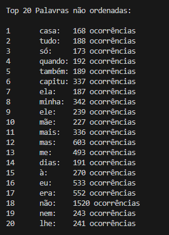

# Aquecimento AEDS - 2 | Top K elementos

>Status: Finalizado

## Descrição
Esse algoritmo é uma combinação eficiente do uso de hash para contar a frequência dos
elementos e heap para manter a lista dos k elementos com maiores valores. Sua complexidade, é de O(nlogk), onde n é o tamanho da coleção de dados
e k o número de itens mais relevantes.

## Arquivos de Entrada
O código aceita quantos arquivos o usuário quiser, desde que estejam nesse padrão:
- Nome do arquivo seja : "txtn.txt" (onde 'n' seja um número inteiro e esteja em ordem crescente em relação ao último algarismo no nome do último arquivo);
- A variável "num_files" que está no "main.cpp" tem que ser alterada para quantidade de arquivos que deseja ler;
- O arquivo de entrada esteja na pasta "dataset";
- É possível remover as palavras que quiser adicionando a mesma no arquivo "stopwords.txt" na pasta "dataset".

## Tabela Hash | Unnordered Map

A biblioteca unordered_map em C++ foi utilizada para montar a hash, aqui estão algumas características dessa biblioteca:

Tabela Hash Interna: O unordered_map mantém uma tabela hash interna para armazenar os elementos.

Função Hash: Cada chave é passada por uma função hash, que gera um valor inteiro chamado hash code. Esse valor é usado para determinar onde o par chave-valor será armazenado na tabela interna.

Resolução de Colisões: Quando dois ou mais pares de chaves diferentes produzem o mesmo valor hash (colisão), eles são armazenados na mesma posição da tabela hash, mas em uma lista ligada. Isso cria uma "cadeia" de elementos com o mesmo valor hash.

Busca e Inserção: Ao buscar um elemento, a função hash é usada para encontrar a posição na tabela interna. Em seguida, a lista ligada nessa posição é percorrida para procurar a chave desejada. Ao inserir um elemento, a mesma abordagem é usada: a posição na tabela é encontrada usando a função hash e, se já houver elementos nessa posição, o novo par chave-valor é adicionado à lista ligada.

Complexidade Amortizada: Embora as operações individuais possam ter complexidade O(n) no pior caso (onde n é o número de elementos na lista ligada), a complexidade amortizada de busca, inserção e remoção em média ainda é O(1), devido à distribuição uniforme das chaves e ao redimensionamento automático da tabela interna.

Redimensionamento: À medida que o número de elementos aumenta, o unordered_map realiza redimensionamento automático da tabela interna para evitar colisões excessivas. Isso envolve a criação de uma nova tabela maior e a realocação dos elementos existentes para as novas posições.

## HEAP | Algorithm

Funções de Heap:
Embora a biblioteca "algorithm" não contenha funções específicas para heaps, ela possui algumas funções que podem ser usadas para manipular e construir heaps. Duas funções importantes nesse contexto são:

+ make_heap(): Transforma um intervalo de elementos em um heap.
+ push_heap(): Insere um elemento no heap e ajusta a estrutura para manter as propriedades do heap.

Algoritmos de Ordenação:
Como a Heap não tem o método de ordenação, para conseguir imprimir na tela os top k elementos ordenados foram utilizadas as seguintes funções:

+ sort(): Algoritmo de ordenação que pode usar heaps como parte de sua implementação em algumas situações.

+ pop_heap(): Remove o elemento de maior prioridade (raiz do heap) e ajusta o heap restante.

## Lógica:
Para começar o algoritmo lê o arquivo "stopwords.txt" e coloca as palavras em um vector, que será usado posteriormente. 
Os arquivos de entrada serão lidos (se estiverem no padrão mencionado na seção "Arquivos de Entrada") e separados em palavras, essas que por sua vez serão colocadas no formato minúsculo, além de remover as pontuações. 
Após essa transformação as palavras passarão pelo teste comparando as stopwords, se não pertencerem a essa lista serão inseridas em uma hash. 
Essa hash terá como chave as palavras e um atributo que conta a quantidade de ocorrências, onde iniciará como 1, e adicionará valores a cada ocorrência da palavra. 
Com a hash pronta podemos iniciar a construção do heap, ele que por sua vez tem a função de pegar os primeiros k valores e ir comparando com os valores contidos na tabela hash, com isso obteremos todos os valores dos k elementos com maior ocorrência não ordenados (pois a heap não ordena). 
Para mostrar de forma ordenada o código usa um sort, apenas para demonstração, mas vale lembrar que isso aumenta o custo do código.

## Exemplo de execução:

#### Arquivo de entrada:

 Dom casmurro (txt1.txt).

#### Arquivo de Saída:

  

  

# Compilação e Execução

 

O algoritmo disponibilizado possui um arquivo Makefile que realiza todo o procedimento de compilação e execução. Para tanto, temos as seguintes diretrizes de execução:
 
 
<body>
    <table border="1px" align="center">
        <tr >
            <td align="center"><h3>Comando</h3></td>
            <td align="center"><h3>Função</h3></td>
        </tr>
        <tr>
            <td>make clean</td>
            <td>Apaga a última compilação realizada contida na pasta build</td>
        </tr>
        <tr>
            <td>make</td>
            <td>Executa a compilação do programa utilizando o gcc, e o resultado vai para a pasta build</td>
        </tr>
        <tr>
            <td>make run</td>
            <td>Executa o programa da pasta build após a realização da compilação</td>
        </tr>
    </table>
</body>
 

